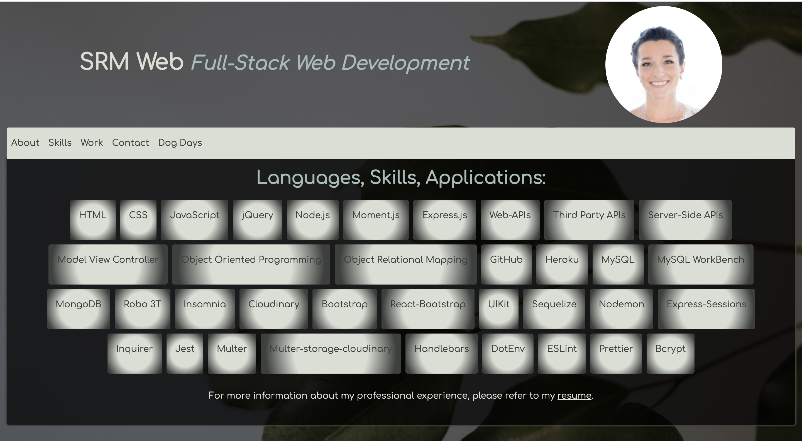

# SRM React Portfolio

## Table of Contents
* [Description](#description)
* [Lessons Learned](#lessons-learned)
* [Demo](#demo)
* [Deployed Link](#deployed-link)
* [Tools](#tools)
* [License](#license)
* [Questions](#questions)
## Description 
This is an update to my web development portfolio. The main change was refactoring the code to use a React format.
This application helps to demonstrate my use and knowledge of React at the early stages of my web development career. I'm hoping to build upon this application as my skills develop.

## Lessons Learned
In building this application I broadened my knowledge of React and it's interface with Bootstrap, routing,icons, github pages, and webkit.

## Demo
  

## Deployed Link
https://sandra-marr.github.io/020_React-Portfolio/

## Tools
                          

## License

Copyright 2021 Sandra Marr

  Permission is hereby granted, free of charge, to any person obtaining a copy of this software and associated documentation files (the "Software"), to deal in the Software without restriction, including without limitation the rights to use, copy, modify, merge, publish, distribute, sublicense, and/or sell copies of the Software, and to permit persons to whom the Software is furnished to do so, subject to the following conditions:
  
  The above copyright notice and this permission notice shall be included in all copies or substantial portions of the Software.
  
  THE SOFTWARE IS PROVIDED "AS IS", WITHOUT WARRANTY OF ANY KIND, EXPRESS OR IMPLIED, INCLUDING BUT NOT LIMITED TO THE WARRANTIES OF MERCHANTABILITY, FITNESS FOR A PARTICULAR PURPOSE AND NONINFRINGEMENT. IN NO EVENT SHALL THE AUTHORS OR COPYRIGHT HOLDERS BE LIABLE FOR ANY CLAIM, DAMAGES OR OTHER LIABILITY, WHETHER IN AN ACTION OF CONTRACT, TORT OR OTHERWISE, ARISING FROM, OUT OF OR IN CONNECTION WITH THE SOFTWARE OR THE USE OR OTHER DEALINGS IN THE SOFTWARE.

## Questions

For any questions, please contact Sandra Marr: [GitHub](https://github.com/sandra-marr) or [Email](srpeters44@gmail.com)
